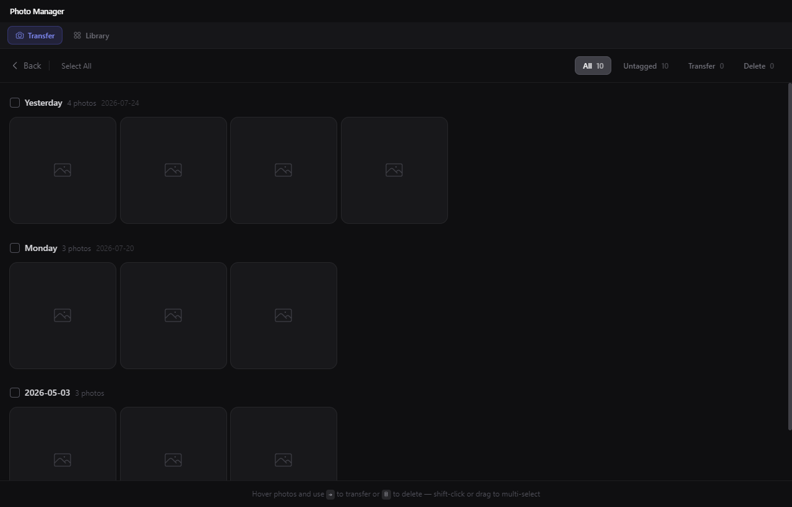
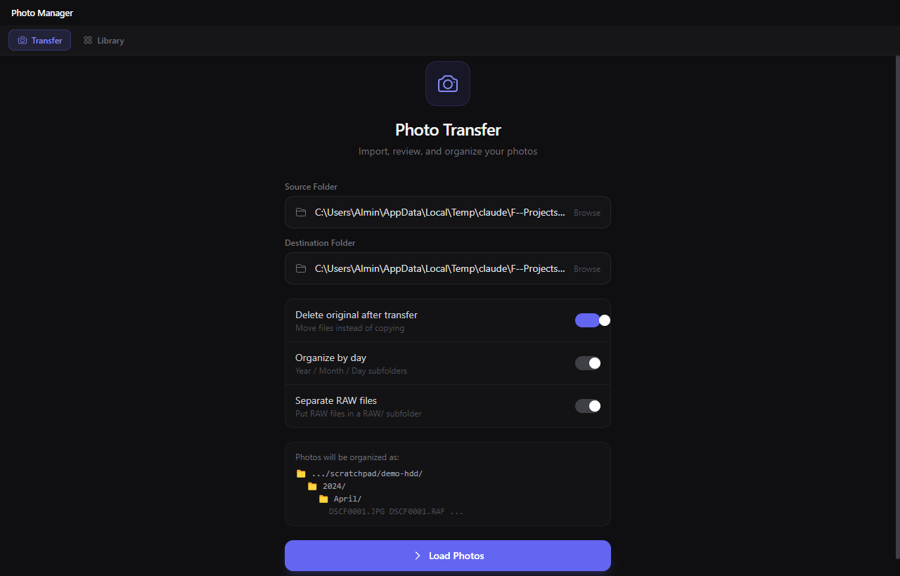
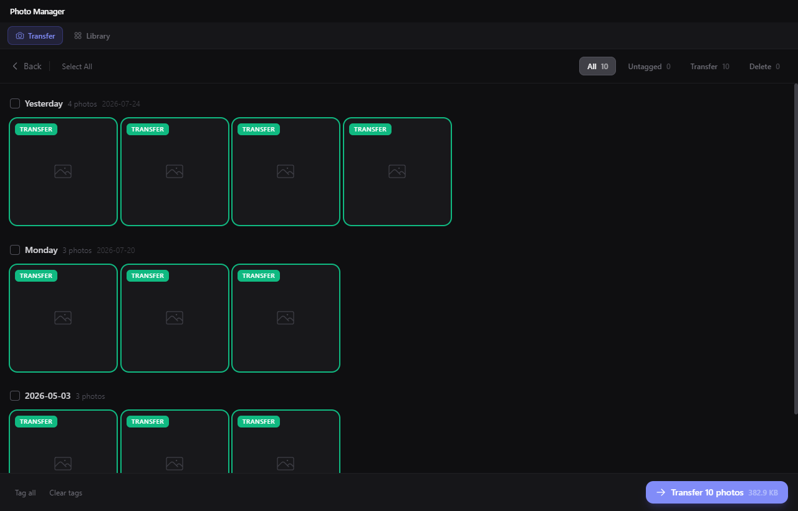
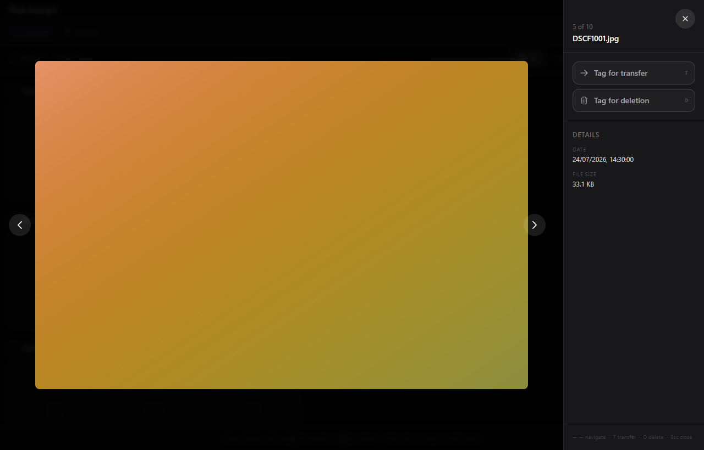
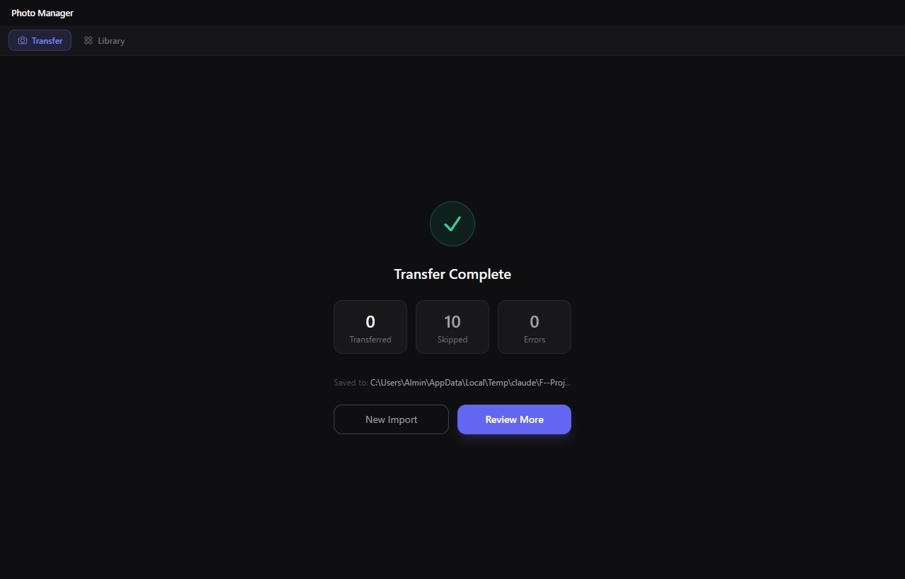

# PhotoMover

A fast, minimal desktop app for importing and organizing photos from SD cards. Review every shot *before* it lands on your drive — tag, move, and delete in one pass.

Think of it as a lightweight, free take on the pro ingest workflow: cull on the card, move (not copy) with verification, and land everything date-organized on your disk.



---

## Features

- **Auto-detects SD cards** — plugging in a card surfaces it instantly as a source option
- **Visual review grid** — browse all photos as thumbnails, grouped by date, before committing to anything
- **Full-resolution preview** — click any photo for a lightbox with EXIF details and keyboard navigation; RAW files show their embedded JPEG preview
- **Tag-based workflow** — mark each photo as *Transfer*, *Delete*, or leave it untagged; filter the grid by any tag; shift-click or drag to multi-select
- **Verified moves** — every copy is checked against the source before the original is deleted; a failed copy never costs you a photo
- **Auto-organizes by date** — photos land in `Destination/YYYY/Month/filename.jpg` (optionally by day); files without a date go to `Unsorted/`
- **True duplicate detection** — files already at the destination are compared by content, not just name and size; real duplicates are skipped, same-name-different-content files are renamed `IMG_0001_1.jpg`, `_2`, …
- **RAW-aware** — reads EXIF from CR2/CR3/NEF/ARW/RAF/ORF/RW2/DNG, extracts embedded thumbnails without decoding the full file, and can separate RAW files into their own subfolder
- **Live transfer progress** — byte-level progress bar with current file name, plus a transferred / skipped / error summary
- **Persistent config** — source, destination, and options are remembered between sessions

There is also an experimental **Library** mode for browsing, star-rating, and pruning an existing photo folder.

---

## Screenshots

| Setup | Review |
|-------|--------|
|  |  |

| Full-resolution preview | Done |
|-------------------------|------|
|  |  |

---

## Folder Structure

Photos are organized automatically by the date taken from EXIF metadata (falling back to the file's modification date):

```
Destination/
├── 2024/
│   ├── April/
│   │   ├── IMG_0001.jpg
│   │   └── IMG_0002.jpg
│   └── March/
│       └── DSC_0099.jpg
├── 2023/
│   └── December/
└── Unsorted/          ← photos with no date at all
```

Optional: `Year/Month/Day/` subfolders, and a `RAW/` subfolder per date for RAW files.

---

## Usage

1. **Insert your SD card** — PhotoMover detects it automatically and shows it as a source option. You can also browse to any folder manually.
2. **Pick a destination** — choose the folder where organized photos should land. Both paths are saved for next time.
3. **Load Photos** — scans the source and streams thumbnails into the review grid.
4. **Tag your shots:**
   - Click a photo to open the full-screen preview; press **T** to tag for transfer, **D** for deletion
   - Shift-click or drag to multi-select, then tag the whole selection at once
   - Use **Tag all** in the action bar to mark everything
5. **Transfer** — hit the Transfer button; a progress bar tracks the operation file by file. Each file is verified before the original is removed.
6. **Review the summary** — see how many files were transferred, skipped, or errored. Start a new import or go back to review more.

---

## Tech Stack

| Layer | Technology |
|-------|-----------|
| Shell | [Electron](https://www.electronjs.org/) 31 |
| UI | [React](https://react.dev/) 18 + [TypeScript](https://www.typescriptlang.org/) 5 |
| Bundler | [electron-vite](https://electron-vite.org/) + Vite 5 |
| Styling | [Tailwind CSS](https://tailwindcss.com/) 3 |
| State | [Zustand](https://zustand-demo.pmnd.rs/) |
| EXIF | [exifr](https://github.com/MikeKovarik/exifr) |
| Thumbnails | [Jimp](https://github.com/jimp-dev/jimp) |
| Tests | [Vitest](https://vitest.dev/) |

All dependencies are pure JavaScript — no native build toolchain required.

---

## Getting Started

### Prerequisites

- [Node.js](https://nodejs.org/) 18 or newer
- npm 9+

### Install

```bash
git clone git@github.com:alminisl/PhotoMover.git
cd PhotoMover
npm install
```

### Run in development

```bash
npm run dev
```

### Test & typecheck

```bash
npm test           # unit + workflow-simulation tests
npm run typecheck  # strict TypeScript check across main, preload, renderer
```

The test suite simulates the full SD-card-to-drive workflow against temp directories: thumbnail generation, date organization, collision renaming, duplicate skipping, and verified moves.

### Build for production

```bash
npm run package
```

The packaged installer will be output to `dist/`.

---

## License

MIT
